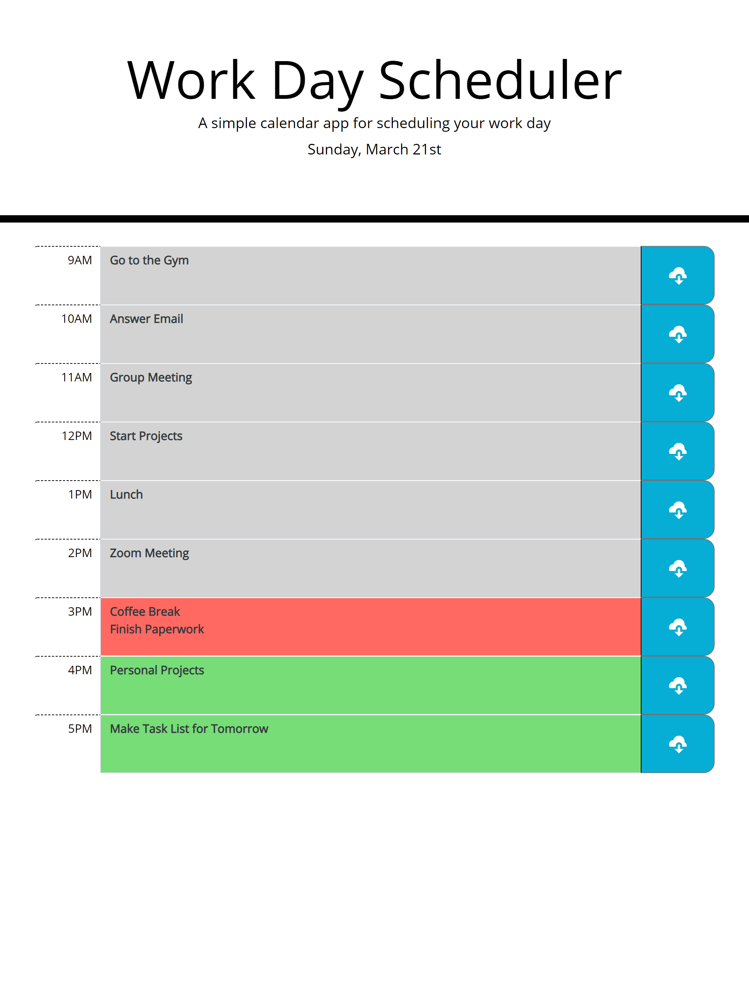

# Work Day Planner

## Table of Contents

1. [Description](#Description)
2. [GitHub Repo and Deployment](#GitHub-Repo-and-Deployment)
3. [Screenshots](#Screenshots)
4. [Technologies](#Technologies)

## Description

* Work Day Scheduler is a daily planner that saves "To-Do Lists" into a local storage. The program utilizes HTML, CSS & Bootstrap, JavaScript & jQuery, and Moment.js for time related features.
  - The planner is organized by the hour, from 9AM to 5PM. (Typical work schedule).
  - Click on the textarea to record to-do list items and click on the blue button on the right to save.

 ## GitHub Repo and Deployment
 *  [Deployed Site](https://ronan-codes.github.io/work-day-planner/)
 *  [GitHub Repo](https://github.com/Ronan-Codes/work-day-planner.git)

 ## Screenshots
 

 ## Technologies
 *  HTML
 *  CSS & Bootstrap
 *  JavaScript & Jquery
 *  Moment.js
